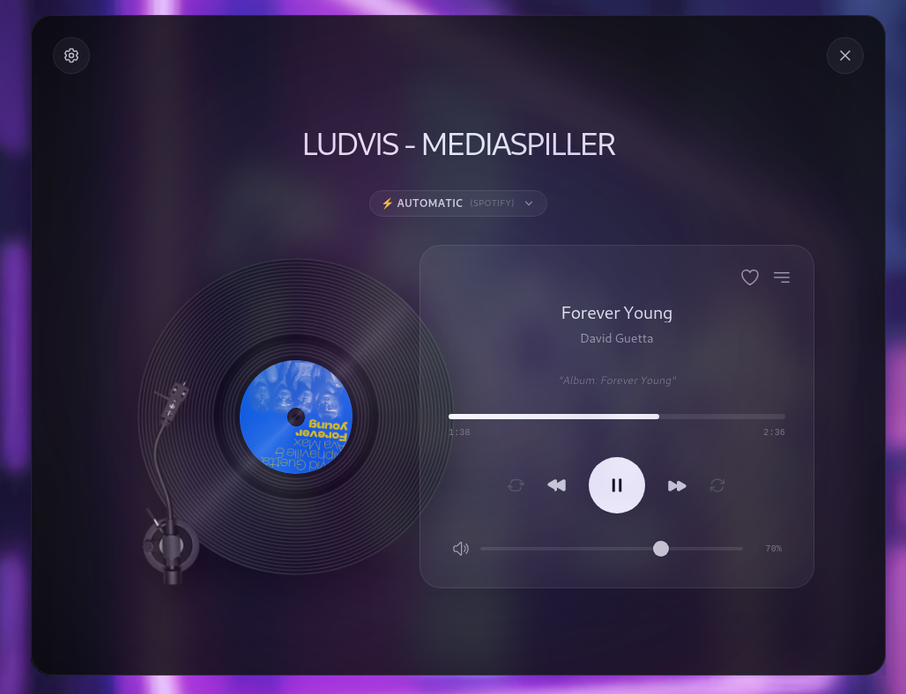
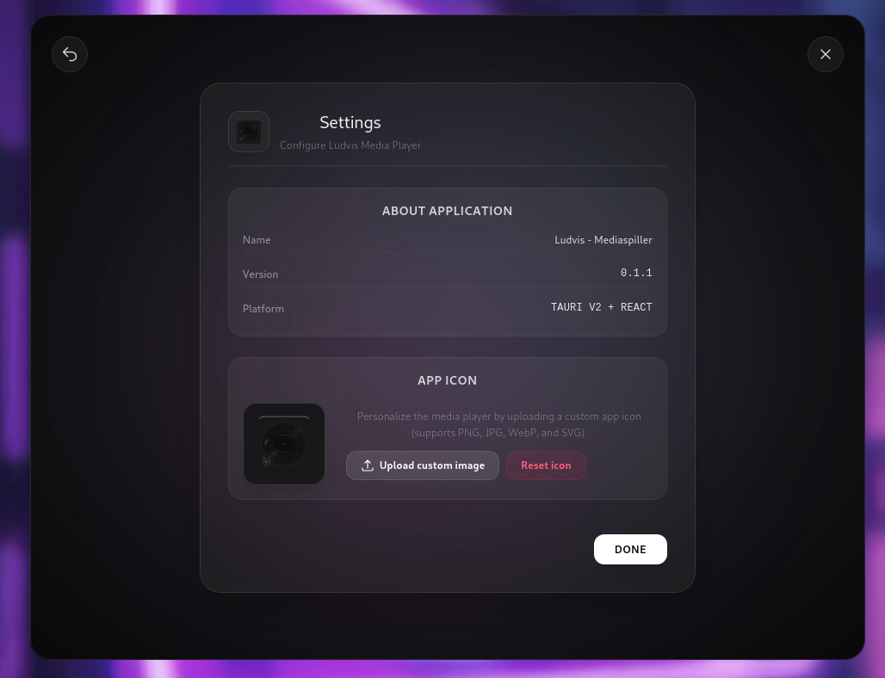

# Ludvis - Mediaspiller

A sleek and modern media player for Linux, built with Tauri v2 and React.

## Screenshots




## Features

- 🎵 **Local Music** – Scan and play audio files from your own folders
- 🎧 **System Audio (MPRIS)** – Automatically syncs with Spotify, Chrome, and other media players via the MPRIS2 protocol
- ⚡ **Smart Source Switching** – Seamlessly switches between local playback and system audio based on activity
- 📋 **Playlist View** – Browse all songs in the selected folder with easy navigation
- 🔀 **Shuffle & Repeat** – Randomize track order or loop your favorite song
- 🔊 **Volume Control** – Integrated volume slider and mute toggle
- 🌐 **Multilingual** – Supports Norwegian, English, and Spanish (auto-detected)
- 🎨 **Customizable** – Change the app name and icon directly from the settings page
- 🖥️ **Modern Design** – Glassmorphism aesthetic with a dark theme and smooth animations

## Tech Stack

- [Tauri v2](https://tauri.app/) – Lightweight desktop framework with a Rust backend
- [React](https://react.dev/) + TypeScript – Frontend framework
- [Vite](https://vitejs.dev/) – Build tool
- MPRIS2 – Linux protocol for cross-player media control

## Installation

Download the latest release from [Releases](../../releases) as an `.rpm` or `.deb` package.

### RPM (Fedora, openSUSE, etc.)
```bash
sudo rpm -i ludvis-mediaspiller_0.1.1_x86_64.rpm
```

### DEB (Ubuntu, Debian, etc.)
```bash
sudo dpkg -i ludvis-mediaspiller_0.1.1_amd64.deb
```

## License

MIT
